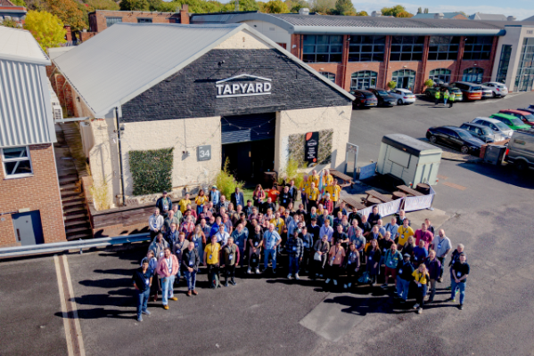

On Wednesday 30 September 2026, the Cross Government Software Engineering Community brought its conference to Newcastle for the first time. GovDev North was a great day for colleagues working in government software engineering to meet, share experience and discuss the work happening across their teams.

The conference ran from 10:30 to 16:30, followed by a social reception, and was supported by Opencast. 

Our chair, Nayyab Naqvi, summed it up in her LinkedIn post: "As Chair of the community, one of the most rewarding things today was simply looking around the room and seeing engineers from across government coming together, not just to talk about technology, but to openly share the real engineering challenges, lessons, failures, patterns and practices behind the public services we build."

## A conference in the North East

After listening to feedback from our conference in 2025 we are so happy we decided on taking the community beyond London!, it gave colleagues in and around the North East an opportunity to meet in person and connect with the wider cross-government engineering community. Newcastle and Opencast you did us proud.

## Talks and conversations

The day brought together talks, discussions and time to connect. More detail will follow on the sessions and ideas attendees took away.

There was an amazing keynote by Michael Brunton Spall 

## Thank you

Thank you to everyone who spoke, attended and helped organise GovDev North, and to Opencast for supporting the event. Events like this depend on people across the community giving their time and sharing what they have learned.

## Stay connected

The Cross Government Software Engineering Community brings together people working on software across government to share experience and learn from one another. [Find out how to join the community](https://uk-cross-government-software-engineering-community.mailchimpsites.com/).

*Shaun Hare, Cross Government Software Engineering Community*