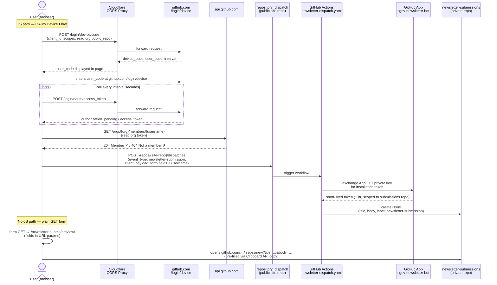
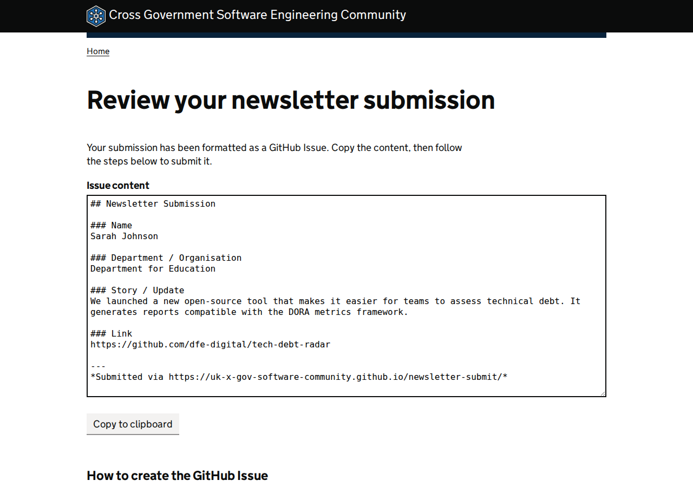
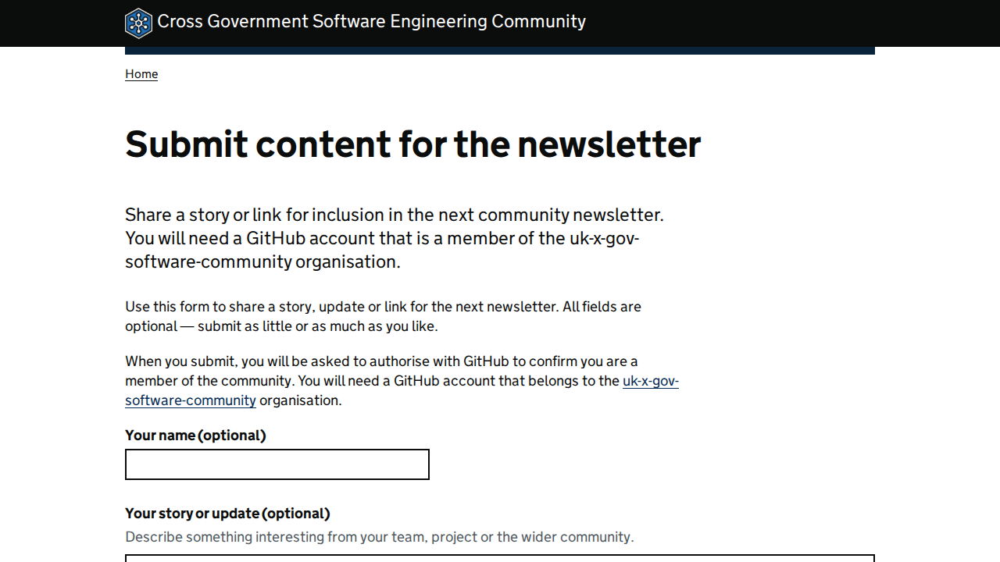

# Newsletter Submission Form

Documentation for the `/newsletter-submit/` feature — a GOV.UK-styled form that lets
community members submit stories and links for the newsletter without needing a GitHub
account or write access to any repository.

---

## Contents

- [User journeys](#user-journeys)
- [Architecture](#architecture)
- [Pages](#pages)
- [Authentication: GitHub OAuth Device Flow](#authentication-github-oauth-device-flow)
- [No-JavaScript path](#no-javascript-path)
- [GitHub Actions dispatch workflow](#github-actions-dispatch-workflow)
- [GitHub App setup](#github-app-setup)
- [OAuth App setup](#oauth-app-setup)
- [Issue schema](#issue-schema)
- [Cloudflare CORS proxy](#cloudflare-cors-proxy)
- [Accessibility](#accessibility)
- [Testing and linting](#testing-and-linting)
- [Setup checklist](#setup-checklist)
- [Screenshots](#screenshots)

---

## User journeys

### With JavaScript (primary path)

1. User visits `/newsletter-submit/`, fills in the optional fields.
2. Clicks **Submit to newsletter**.
3. Page drives the GitHub OAuth Device Flow — displays a short code and opens
   `https://github.com/login/device` in a new tab.
4. User enters the code on GitHub and authorises the app.
5. Page polls for the access token, then verifies the user is an org member.
6. If verified: fires a `repository_dispatch` event on the public site repo.
7. GitHub Actions workflow picks up the event and creates an issue in the private
   `newsletter-submissions` repository using a short-lived GitHub App token.
8. Page shows a GOV.UK green confirmation panel. No link to the private issue is shown.

### Without JavaScript (fallback path)

1. User visits `/newsletter-submit/`, fills in the fields, and clicks **Submit to newsletter**.
2. Browser performs a plain HTML GET to `/newsletter-submit/preview/`.
3. The preview page reads the URL params, formats the issue body markdown, and displays
   it in a read-only text area.
4. A **Copy to clipboard** button (native Clipboard API — no library) copies the content.
5. An **Open GitHub** link pre-fills the title and body on the GitHub new-issue page via
   `?title=...&body=...` query params.
6. User submits the GitHub Issue directly.

---

## Architecture



The user's OAuth token only ever reads org membership and triggers a dispatch on the
**public** site repo (requiring `public_repo`, not `repo`). Writing to the private
repository is done exclusively by a short-lived GitHub App installation token that is
never exposed to the browser and expires after one hour.

---

## Pages

### `/newsletter-submit/`

Source: `newsletter-submit.njk`

The main submission form. Fields:

| Field | Component | Autocomplete |
|-------|-----------|--------------|
| Your name | `govuk-input` | `name` |
| Your department or organisation | `govuk-input` | `organization` |
| Your story or update | `govuk-textarea` | — |
| A relevant link | `govuk-input` | `url` |

The `<form>` element has `action="/newsletter-submit/preview/" method="GET"` so it
degrades cleanly to the preview page when JavaScript is unavailable. JavaScript
intercepts `submit` and runs the OAuth flow instead.

### `/newsletter-submit/preview/`

Source: `newsletter-submit-preview.njk`

The no-JavaScript review page. When reached via GET form submission, URL params
(`name`, `department`, `story`, `link`) are read by a small inline script that:

- Formats the issue body markdown and populates a `readonly` textarea.
- Updates the **Open GitHub** link to include `?title=...&body=...` so the issue is
  pre-filled on GitHub.
- Enables the **Copy to clipboard** button using `navigator.clipboard.writeText()`
  (Clipboard API) with a `document.execCommand('copy')` fallback for older browsers.

If JavaScript is also disabled on the preview page, a static markdown template is
shown in the textarea and the GitHub link opens a blank new-issue form.



---

## Authentication: GitHub OAuth Device Flow

The Device Flow requires no `client_secret` in the browser, making it the only viable
OAuth flow for a purely static site.

### Scopes

| Scope | Purpose |
|-------|---------|
| `read:org` | Verify the user is a member of `uk-x-gov-software-community` |
| `public_repo` | Trigger `repository_dispatch` on the public site repo |

This is a deliberate security choice. `public_repo` is much narrower than the full
`repo` scope (which would grant write access to all private repositories).

### Flow

1. User submits the form; JS `POST`s to the CORS proxy → `github.com/login/device/code`
   with `client_id` and scopes.
2. GitHub returns `device_code`, `user_code`, `verification_uri`, `expires_in`,
   `interval`.
3. Page displays the `user_code` in a GOV.UK inset panel and opens
   `https://github.com/login/device` in a new tab.
4. An `aria-live="polite"` region announces "Waiting for you to authorise on GitHub…".
5. JS polls the proxy → `github.com/login/oauth/access_token` every `interval` seconds.
6. On success: verify org membership via `api.github.com`.
   - HTTP 204 → member, proceed to dispatch.
   - HTTP 404 / 302 → not a member, display GOV.UK error panel.
7. If member: `POST` to `api.github.com/repos/.../dispatches` with
   `event_type: "newsletter-submission"` and sanitised form fields in `client_payload`.
8. Show GOV.UK green confirmation panel.

---

## No-JavaScript path

The `<form>` element carries `action="/newsletter-submit/preview/" method="GET"` and
`novalidate` (custom GOV.UK-style client-side validation runs in JS). When JS is absent:

- The form submits as a standard browser GET.
- All field values appear in the URL query string.
- The preview page reads them, formats the markdown, and guides the user to create a
  GitHub Issue manually.

A `<noscript>` inset on the form page informs users of this fallback path rather than
blocking them with a warning.

---

## GitHub Actions dispatch workflow

File: `.github/workflows/newsletter-dispatch.yaml`

```yaml
on:
  repository_dispatch:
    types: [newsletter-submission]

jobs:
  create-issue:
    runs-on: ubuntu-latest
    steps:
      - name: Generate GitHub App installation token
        id: app-token
        uses: actions/create-github-app-token@v1
        with:
          app-id: ${{ secrets.NEWSLETTER_APP_ID }}
          private-key: ${{ secrets.NEWSLETTER_APP_PRIVATE_KEY }}
          owner: uk-x-gov-software-community
          repositories: newsletter-submissions

      - name: Create issue in private repo
        uses: actions/github-script@v7
        with:
          github-token: ${{ steps.app-token.outputs.token }}
          script: |
            const { name, department, story, link, github_username, submitted_at } =
              context.payload.client_payload
            await github.rest.issues.create({
              owner: 'uk-x-gov-software-community',
              repo:  'newsletter-submissions',
              title: `Newsletter Submission – ${submitted_at}`,
              labels: ['newsletter-submission'],
              body:   formatBody({ name, department, story, link, github_username, submitted_at })
            })
```

The workflow uses a **GitHub App** (not a PAT) so the credential is short-lived,
scoped to a single repository, and automatically rotated. No long-lived token is
ever stored or logged.

---

## GitHub App setup

One-time manual steps to configure the bot:

1. Create a new GitHub App in the `uk-x-gov-software-community` org:
   - **Name**: `cgov-newsletter-bot`
   - **Homepage URL**: `https://uk-x-gov-software-community.github.io`
   - **Webhook**: disabled
   - **Repository permissions**: `Issues: write` only
   - **Where can this app be installed**: "Only on this account"
2. Generate and download the private key (PEM file).
3. Install the App on the `newsletter-submissions` repository **only**.
4. Add two secrets to the **public site repo**:
   - `NEWSLETTER_APP_ID` — numeric App ID (shown on the App settings page)
   - `NEWSLETTER_APP_PRIVATE_KEY` — full contents of the downloaded PEM file

The `actions/create-github-app-token` action exchanges these for a scoped,
short-lived installation token at job start. The token expires after one hour and
is never echoed in logs.

---

## OAuth App setup

One-time manual steps:

1. Register an OAuth App under the `uk-x-gov-software-community` org:
   - **Application name**: "Cross-Gov Software Community – Newsletter Submissions"
   - **Homepage URL**: `https://uk-x-gov-software-community.github.io`
   - **Device Flow**: enabled (checkbox in app settings)
   - **Callback URL**: `https://uk-x-gov-software-community.github.io/newsletter-submit/`
     (unused by Device Flow but required by GitHub)
2. Copy the `client_id` (safe to expose publicly — there is no `client_secret` in any file).
3. Set the `CLIENT_ID` constant at the top of `assets/newsletter-submit.js`.

---

## Issue schema

Issues created in `uk-x-gov-software-community/newsletter-submissions`:

```
Title:  Newsletter Submission – YYYY-MM-DD
Labels: newsletter-submission

## Newsletter Submission

**Submitted by:** @{github_username} on {date}

### Name
{name or "(not provided)"}

### Department / Organisation
{department or "(not provided)"}

### Story / Update
{story or "(not provided)"}

### Link
{link or "(not provided)"}

---
*Submitted via https://uk-x-gov-software-community.github.io/newsletter-submit/*
```

For manually created issues (no-JS path), the body follows the same structure.
An issue template matching this schema is stored in
`.github/ISSUE_TEMPLATE/newsletter-submission.yml` — copy it to the
`newsletter-submissions` repository so GitHub pre-fills the form when issues
are opened there manually.

---

## Cloudflare CORS proxy

`github.com/login/device/code` and `github.com/login/oauth/access_token` do not send
CORS headers. A minimal Cloudflare Worker (free tier) proxies only these two endpoints,
adding `Access-Control-Allow-Origin: *`. No secrets pass through the proxy — it
forwards the request body verbatim.

Source (~15 lines): `cloudflare-worker/`

The proxy URL is a single constant at the top of `assets/newsletter-submit.js`. If the
proxy is unavailable, the JS catches the error and the user is directed to the no-JS
path.

---

## Accessibility

| Requirement | Implementation |
|-------------|---------------|
| All form fields labelled | Visible `<label>` associated via `for`/`id` |
| Errors announced | GOV.UK error-summary + inline error pattern |
| Live polling status | `aria-live="polite"` region on the device-code panel |
| Confirmation panel | `role="alert"` (assertive) — replaces the form entirely |
| GOV.UK Design System | All components use govuk-frontend classes |
| WCAG 2.2 AA | Meets GOV.UK accessibility checklist |

---

## Testing and linting

```bash
npm test       # Vitest unit tests
npm run lint   # ESLint over assets/ and tests/
```

Unit tests in `tests/newsletter-submit.test.js` cover the pure functions exported
from `assets/newsletter-submit.js`:

| Function | Scenarios tested |
|----------|-----------------|
| `formatIssueBody(data)` | All fields; all empty; partial; XSS-safe output |
| `validateLink(url)` | Valid https/http; empty string; non-URL string |
| `buildIssueTitle(date)` | Expected title string |
| `buildDispatchPayload(formData, username, date)` | Correct shape; fields sanitised |
| `parseDeviceCodeResponse(json)` | Valid response; missing fields |
| `isMemberResponse(status)` | 204 → true; 404 → false; 302 → false |

CI runs `npm run lint && npm test` before the Eleventy build step on every push
(`.github/workflows/build.yaml`).

---

## Setup checklist

Before the feature goes live, complete the following:

- [ ] Create private `newsletter-submissions` repository in the org
- [ ] Create `newsletter-submission` label in `newsletter-submissions`
- [ ] Copy `.github/ISSUE_TEMPLATE/newsletter-submission.yml` to `newsletter-submissions`
- [ ] Create GitHub App `cgov-newsletter-bot` in the org (Issues: write, webhook off)
- [ ] Install the App on `newsletter-submissions` only
- [ ] Download App private key (PEM)
- [ ] Add `NEWSLETTER_APP_ID` secret to the public site repo
- [ ] Add `NEWSLETTER_APP_PRIVATE_KEY` secret to the public site repo
- [ ] Register GitHub OAuth App in the org; enable Device Flow
- [ ] Add `client_id` constant to `assets/newsletter-submit.js`
- [ ] Deploy Cloudflare Worker; set proxy URL constant in `newsletter-submit.js`
- [ ] Verify org membership check with a test account
- [ ] Test full end-to-end flow (JS path) in a browser
- [ ] Test no-JS path: disable JS, submit form, verify preview page, copy, open GitHub

---

## Screenshots

### Submission form



### Preview page (no-JavaScript path)


