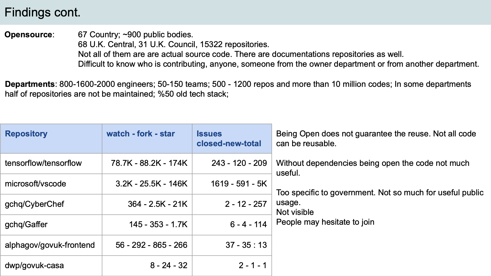
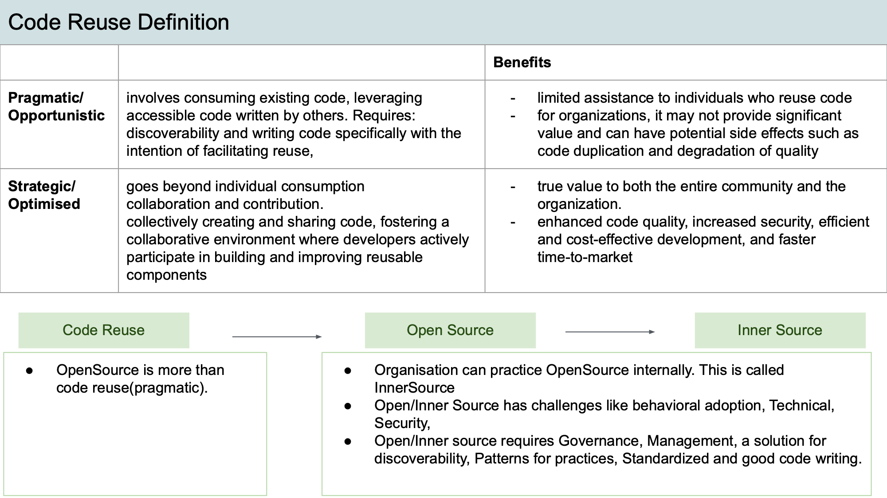
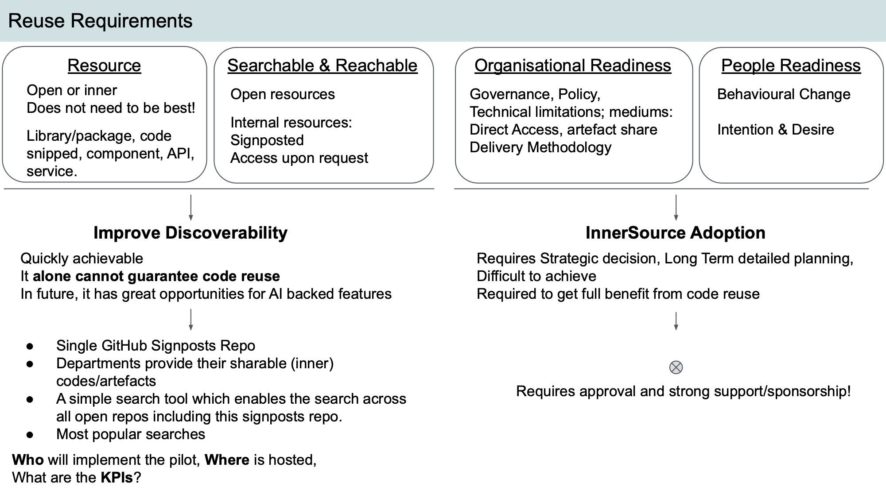
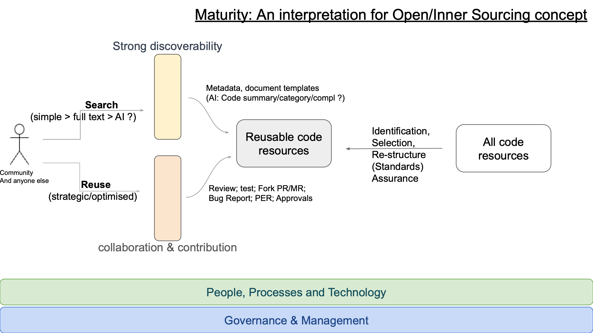
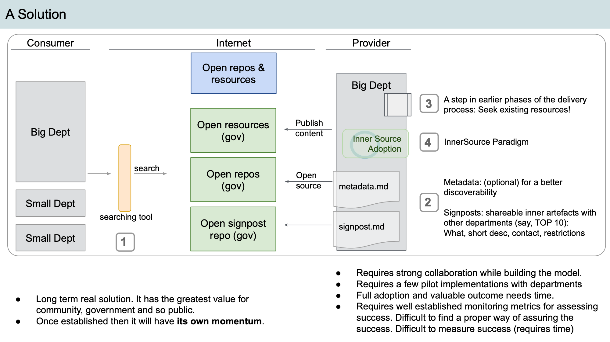

# Code reuse - Open/Inner Source Presentation - 19 May 2023

Presenter: [Soydaner](https://github.com/soydaner)

## Code reuse - Open/Inner Source
* Intro
* Findings
* Today's Picture
* Code reuse definition
* Requirements
* Maturity: An interpretation for Open/Inner Sourcing concept
* A Solution
* Closing

## Findings 
### Sharing reusing: 
* No internal sharing/reusing practices 
* There are successful projects that can be reusable are in open repositories. 
* No external usage/contribution to them 
* 15K open repositories 
  * Few of them getting hit/popular 
* Not all repos are for reuse: document/solution specific 
* Security and technical (network, for example) restrictions 
* Even if people decided to reuse/contribute, departments are not ready to meet this collaboration ○ Capability, Maturity 
  * No governance, management, standardization, 
  * Tech issues: synchronization, Security (for sharing internal resources with other departments)
  * Behavioural: Teams are isolated. Project Delivery methodologies does not support mutual collaboration, dependencies 
  * Orgs internal structures are different and their security restrictions and networking patterns are too restrictive to accept  collaboration from other departments. 

### Open 
* Reputation, Accountability, Responsibility are all OK. 
* Without collaboration, it is not possible to reach: better security, quality, and rich content. (+ open to duplication) ○ Contrary, these goals may be affected badly by lack of collaboration. (for example: not easy to identify security flaws.)
* Being Open: we have 15K repo and for a long time we are open,. how much value it adds to us so far? And metrics (KPIs) ?  and monitoring? 
* Then a question: what is the true value of being open!

## Findings cont. 
### Opensource: 
- 67 Country; ~900 public bodies.  
- 68 U.K. Central, 31 U.K. Council, 15322 repositories. 
- Not all of them are are actual source code. There are documentations repositories as well. 
- Difficult to know who is contributing, anyone, someone from the owner department or from another department. 

### Departments: 
- 800-1600-2000 engineers; 50-150 teams
- 500 - 1200 repos and more than 10 million codes
- In some departments  half of repositories are not be maintained
- 50% old tech stack 

| Repository            | watch - fork - star  | Issues closed-new-total  |
|-----------------------|----------------------|--------------------------| 
| tensorflow/tensorflow | 78.7K - 88.2K - 174K | 243 - 120 - 209          |
| microsoft/vscode      | 3.2K - 25.5K - 146K  | 1619 - 591 - 5K          |
| gchq/CyberChef        | 364 - 2.5K - 21K     | 2 - 12 - 257             |
| gchq/Gaffer           | 145 - 353 - 1.7K     | 6 - 4 - 114              |
| alphagov/govuk-frontend | 56 - 292 - 865 - 266 | 37 - 35 : 13           |
| dwp/govuk-casa        | 8 - 24 - 32          | 2 - 1 - 1                |

Being Open does not guarantee the reuse. Not all code  can be reusable. 
Without dependencies being open the code not much  useful. 
Too specific to government. Not so much for useful public  usage. 
Not visible.
People may hesitate to join 

## Today 

* Big departments have capacity to provide  reusable valuable content. Do not expect  same from small ones. 
* They have governance for technology  reuse 
* They share sharable and reusable  artefacts as open. 
* not everything is open and can be open. 
* There is no maturity for code reuse (Both  organisational and individual) 
* Internal resources has no discoverability  and visibility to outsider 
* No structured/defined inter departmental  

## Code Reuse Definition 
|                         |    | Benefits |
|-------------------------|----|----------|
| Pragmatic/Opportunistic | involves consuming existing code, leveraging  accessible code written by others. Requires:  discoverability and writing code specifically with the  intention of facilitating reuse | Limited assistance to individuals who reuse code - for organizations, it may not provide significant  value and can have potential side effects such as  code duplication and degradation of quality. True value to both the entire community and the  organization. |
| Strategic/Optimised     | goes beyond individual consumption collaboration and contribution. collectively creating and sharing code, fostering a  collaborative environment where developers actively  participate in building and improving reusable components | enhanced code quality, increased security, efficient  and cost-effective development, and faster  time-to-market |

### Code Reuse 
* OpenSource is more than  code reuse(pragmatic). 
### Open Source -->  Inner Source
* Organisation can practice OpenSource internally. This is called  InnerSource 
* Open/Inner Source has challenges like behavioural adoption, Technical,  Security,  
* Open/Inner source requires Governance, Management, a solution for  discoverability, Patterns for practices, Standardized and good code writing.  

## Reuse Requirements 
### Resource 
- Open or inner  
- Does not need to be best! 
- Library/package, code  snipped, component, API,  service. 
### Searchable & Reachable 
- Open resources 
- Internal resources: Signposted 
- Access upon request 
### Organisational Readiness 
- Governance, Policy
- Technical limitations; mediums: Direct Access, artefact share Delivery Methodology
### People Readiness 
- Behavioural Change Intention & Desire 

### Improve Discoverability 
- Quickly achievable 
- It alone cannot guarantee code reuse 
- In future, it has great opportunities for AI backed features 
- Single GitHub Signposts Repo 
- Departments provide their sharable (inner)  codes/artefacts 
- A simple search tool which enables the search across  all open repos including this signposts repo. 
- Most popular searches 
- Who will implement the pilot, Where is hosted, What are the KPIs?

### InnerSource Adoption 
- Requires Strategic decision, Long Term detailed planning,  Difficult to achieve 
- Required to get full benefit from code reuse 
- Requires approval and strong support/sponsorship! 
- 

## Maturity: An interpretation for Open/Inner Sourcing concept

## A Solution 

* Long term real solution. It has the greatest value for  community, government and so public.  
* Once established then it will have its own momentum. 
* Requires strong collaboration while building the model. 
* Requires a few pilot implementations with departments
* Full adoption and valuable outcome needs time.
* Requires well established monitoring metrics for assessing  
success. Difficult to find a proper way of assuring the  success. Difficult to measure success (requires time) 

## A metaphor and closing 
> "We can only provide the soil, fertilizer, and seeds; it is the farmers who do the planting,  watering, and harvesting, and the yield and quality of the crop cannot be guaranteed in  advance!"

Just as providing the raw materials for farming does not ensure a successful harvest, simply  making code available for reuse does not guarantee its effectiveness. To truly benefit the  community and the original source, a more collaborative approach like Open Source  methodology is preferred, where not only reuse but also contribution is encouraged. For  organizations, InnerSource is often the necessary first step for code reuse. However, no  approach or solution can guarantee that code will be effectively reused or produce desired  outcomes. 

### Some resources 
- [innersource commons](https://innersourcecommons.org/)
- [NHS how-to-publish-your-code-in-the-open](https://nhsdigital.github.io/rap-community-of-practice/implementing_RAP/how-to-publish-your-code-in-the-open/) 
- [gov.us metadata_examples.md](https://github.com/GSA/code-gov/blob/master/docs/metadata_examples.md)
- [Descriptor Format of Catalog Entities | Backstage Software Catalog and Developer Platform](https://backstage.io/docs/features/software-catalog/descriptor-format/#overall-shape-of-an-entity)

